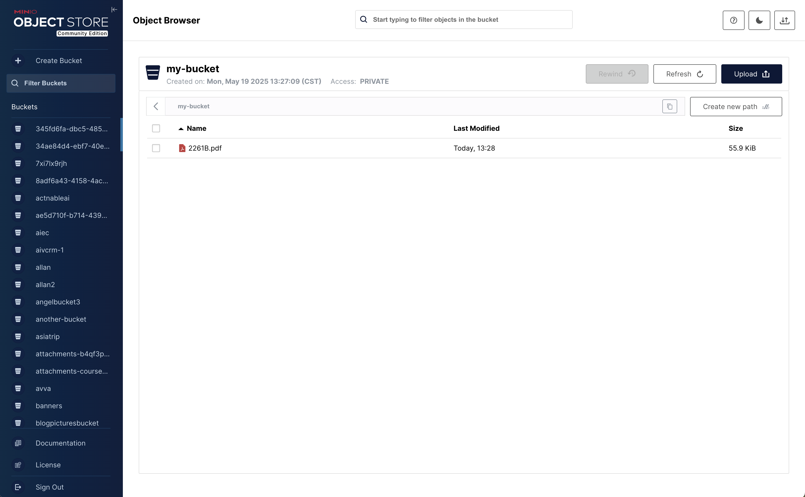
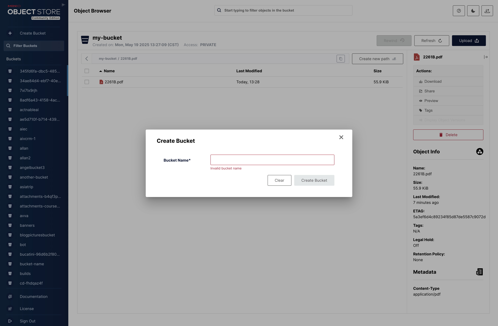
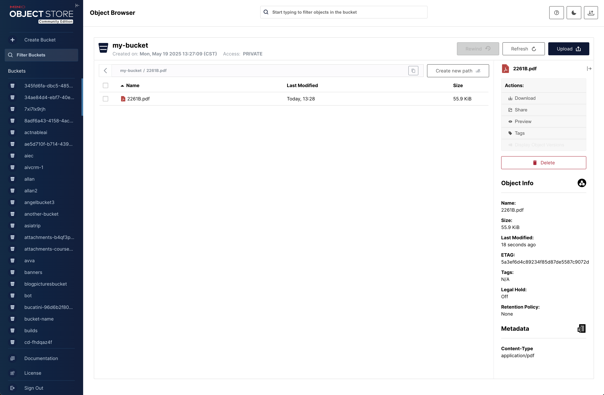
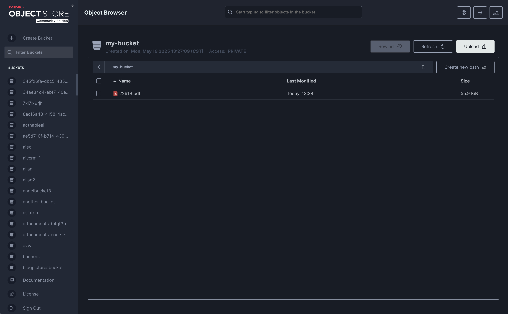
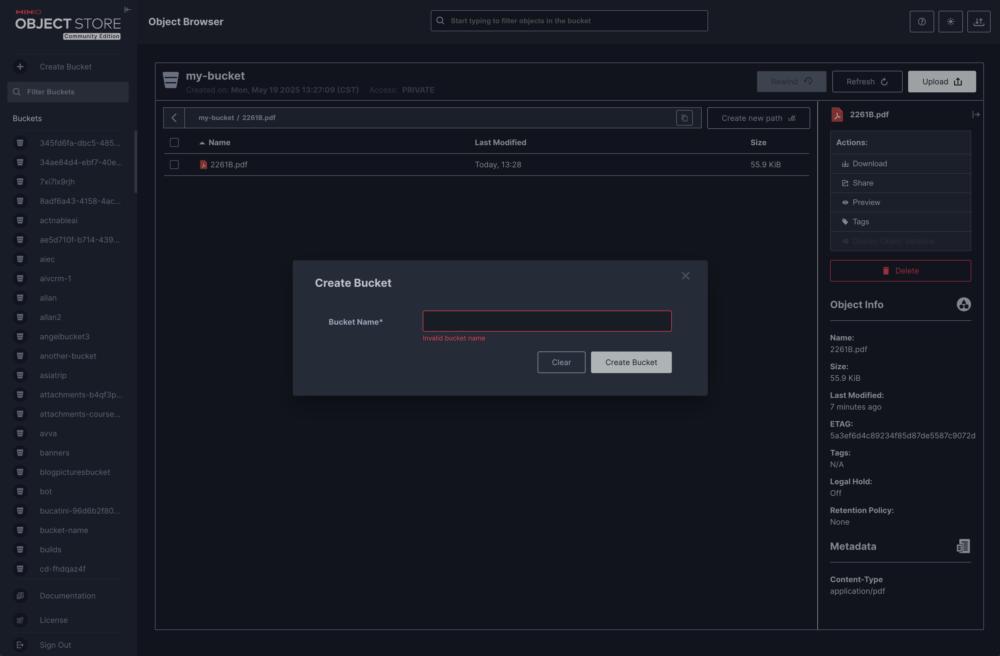
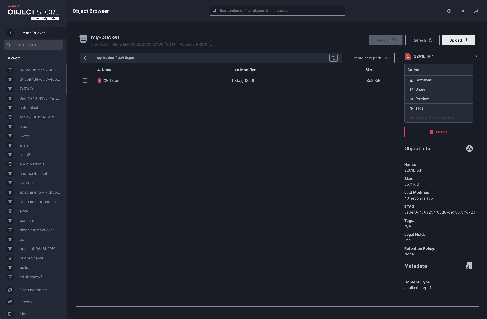

# MinIO Console

 

A graphical user interface for [MinIO](https://github.com/lgcorzo/minio) maintained under the **Sovereign MinIO Ecosystem** by [@lgcorzo](https://github.com/lgcorzo).

| Object Browser                       | Creating a bucket                     | Object Details                  |
|--------------------------------------|-------------------------------|---------------------------------|
|  |  |  |
|  |  |  |

---

## Sovereign Maintenance & Dark Gravity Factory Integration

This repository (`lgcorzo/console`) is actively maintained as a core component of the **Sovereign MinIO Ecosystem** and the **Dark Gravity Autonomous AI Factory**.

### Strategic Rationale

1. **Full Supply-Chain Autonomy**: Zero reliance on upstream breaking license changes or unannounced deprecations. Maintain complete ownership of operational UI tools and management capabilities.
2. **Dark Gravity Factory Core Integration**: Essential component powering graphical bucket policy management, IAM administration, and observability dashboards for high-throughput AI storage and automated agent pipelines.
3. **Compliance & Security**: Sovereign maintenance guaranteeing compliance with EU AI Act, SOC 2 Type II, ISO 25059, and strict zero-CVE SLAs.
4. **Ecosystem Interoperability**: Direct seamless integration with all 38 repositories in `@lgcorzo` (MinIO Server, MC, KES, Operator, DirectPV, Console, SIMD acceleration libraries, etc.).

---

## 38-Repo Sovereign Ecosystem

| Category | Repositories |
|---|---|
| **Core Storage & Server** | `lgcorzo/minio`, `lgcorzo/console`, `lgcorzo/mc`, `lgcorzo/operator`, `lgcorzo/directpv`, `lgcorzo/kes` |
| **SDKs & Clients** | `lgcorzo/minio-go`, `lgcorzo/minio-java`, `lgcorzo/minio-js`, `lgcorzo/minio-py`, `lgcorzo/minio-dotnet`, `lgcorzo/minio-cpp`, `lgcorzo/madmin-go` |
| **High-Performance SIMD Libraries** | `lgcorzo/sha256-simd`, `lgcorzo/md5-simd`, `lgcorzo/blake2b-simd`, `lgcorzo/highwayhash`, `lgcorzo/simdjson-go` |
| **Compression & Erasure Coding** | `lgcorzo/compress`, `lgcorzo/s2`, `lgcorzo/reed-solomon-simd`, `lgcorzo/klauspost-compress` |
| **Security & Encryption** | `lgcorzo/sio-go`, `lgcorzo/kms-go`, `lgcorzo/pkg` |
| **Infrastructure & Utilities** | `lgcorzo/cli`, `lgcorzo/elfloader`, `lgcorzo/filepath`, `lgcorzo/colorjson`, `lgcorzo/crc64nvme`, `lgcorzo/selfupdate`, `lgcorzo/websocket`, `lgcorzo/sidekick`, `lgcorzo/dsm-operator`, `lgcorzo/mcp-server` |

---

## Automated CI/CD Maintenance Architecture

```
+-----------------------------------------------------------------------------------+
|                            Automated Maintenance Pipeline                         |
+-----------------------------------------------------------------------------------+
|  [ Upstream Sync / CVE Watcher ]                                                  |
|                 |                                                                 |
|                 v                                                                 |
|  [ Automated Code Refactoring & Import Migration ] (github.com/minio -> lgcorzo)  |
|                 |                                                                 |
|                 v                                                                 |
|  [ Multi-Platform CI Matrix ] (Linux, macOS, Windows / Go 1.24+)                  |
|                 |                                                                 |
|                 +---> [ Security & Vuln Scan ] (govulncheck & CodeQL)             |
|                 +---> [ Unit, Race & Integration Tests ]                            |
|                 |                                                                 |
|                 v                                                                 |
|  [ Tagged Sovereign Release Build & Multi-Arch Container Image Deploy ]           |
+-----------------------------------------------------------------------------------+
```

---

<!-- markdown-toc start - Don't edit this section. Run M-x markdown-toc-refresh-toc -->
**Table of Contents**

- [MinIO Console](#minio-console)
  - [Sovereign Maintenance & Dark Gravity Factory Integration](#sovereign-maintenance--dark-gravity-factory-integration)
  - [38-Repo Sovereign Ecosystem](#38-repo-sovereign-ecosystem)
  - [Automated CI/CD Maintenance Architecture](#automated-cicd-maintenance-architecture)
  - [Setup](#setup)
    - [1. Create a user `console` using `mc`](#1-create-a-user-console-using-mc)
    - [2. Create a policy for `console` with admin access to all resources (for testing)](#2-create-a-policy-for-console-with-admin-access-to-all-resources-for-testing)
    - [3. Set the policy for the new `console` user](#3-set-the-policy-for-the-new-console-user)
  - [Start Console service:](#start-console-service)
  - [Start Console service with TLS:](#start-console-service-with-tls)
  - [Connect Console to a Minio using TLS and a self-signed certificate](#connect-console-to-a-minio-using-tls-and-a-self-signed-certificate)
- [Contribute to console Project](#contribute-to-console-project)

<!-- markdown-toc end -->

MinIO Console is a library that provides a management and browser UI overlay for the MinIO Server.

## Setup

All `console` needs is a MinIO user with admin privileges and URL pointing to your MinIO deployment.

> [!NOTE]
> We don't recommend using MinIO's Operator Credentials

### 1. Create a user `console` using `mc`

```bash
mc admin user add myminio/
Enter Access Key: console
Enter Secret Key: xxxxxxxx
```

### 2. Create a policy for `console` with admin access to all resources (for testing)

```sh
cat > admin.json << EOF
{
	"Version": "2012-10-17",
	"Statement": [{
			"Action": [
				"admin:*"
			],
			"Effect": "Allow",
			"Sid": ""
		},
		{
			"Action": [
                "s3:*"
			],
			"Effect": "Allow",
			"Resource": [
				"arn:aws:s3:::*"
			],
			"Sid": ""
		}
	]
}
EOF
```

```sh
mc admin policy create myminio/ consoleAdmin admin.json
```

### 3. Set the policy for the new `console` user

```sh
mc admin policy attach myminio consoleAdmin --user=console
```

> [!NOTE]
> Additionally, you can create policies to limit the privileges for other `console` users, for example, if you
> want the user to only have access to dashboard, buckets, notifications and watch page, the policy should look like
> this:
> ```json
> {
>   "Version": "2012-10-17",
>   "Statement": [
>     {
>       "Action": [
> 	"admin:ServerInfo"
>       ],
>       "Effect": "Allow",
>       "Sid": ""
>     },
>     {
>       "Action": [
> 	"s3:ListenBucketNotification",
> 	"s3:PutBucketNotification",
> 	"s3:GetBucketNotification",
> 	"s3:ListMultipartUploadParts",
> 	"s3:ListBucketMultipartUploads",
> 	"s3:ListBucket",
> 	"s3:HeadBucket",
> 	"s3:GetObject",
> 	"s3:GetBucketLocation",
> 	"s3:AbortMultipartUpload",
> 	"s3:CreateBucket",
> 	"s3:PutObject",
> 	"s3:DeleteObject",
> 	"s3:DeleteBucket",
> 	"s3:PutBucketPolicy",
> 	"s3:DeleteBucketPolicy",
> 	"s3:GetBucketPolicy"
>       ],
>       "Effect": "Allow",
>       "Resource": [
> 	"arn:aws:s3:::*"
>       ],
>       "Sid": ""
>     }
>   ]
> }
> ```

## Start Console service:

Before running console service, following environment settings must be supplied

```sh
# Salt to encrypt JWT payload
export CONSOLE_PBKDF_PASSPHRASE=SECRET

# Required to encrypt JWT payload
export CONSOLE_PBKDF_SALT=SECRET

# MinIO Endpoint
export CONSOLE_MINIO_SERVER=http://localhost:9000
```

Now start the console service.

```
./console server
2021-01-19 02:36:08.893735 I | 2021/01/19 02:36:08 server.go:129: Serving console at http://localhost:9090
```

By default `console` runs on port `9090` this can be changed with `--port` of your choice.

## Start Console service with TLS:

Copy your `public.crt` and `private.key` to `~/.console/certs`, then:

```sh
./console server
2021-01-19 02:36:08.893735 I | 2021/01/19 02:36:08 server.go:129: Serving console at http://[::]:9090
2021-01-19 02:36:08.893735 I | 2021/01/19 02:36:08 server.go:129: Serving console at https://[::]:9443
```

For advanced users, `console` has support for multiple certificates to service clients through multiple domains.

Following tree structure is expected for supporting multiple domains:

```sh
 certs/
  │
  ├─ public.crt
  ├─ private.key
  │
  ├─ example.com/
  │   │
  │   ├─ public.crt
  │   └─ private.key
  └─ foobar.org/
     │
     ├─ public.crt
     └─ private.key
  ...

```

## Connect Console to a Minio using TLS and a self-signed certificate

Copy the MinIO `ca.crt` under `~/.console/certs/CAs`, then:

```sh
export CONSOLE_MINIO_SERVER=https://localhost:9000
./console server
```

You can verify that the apis work by doing the request on `localhost:9090/api/v1/...`

## Debug logging

In some cases it may be convenient to log all HTTP requests. This can be enabled by setting
the `CONSOLE_DEBUG_LOGLEVEL` environment variable to one of the following values:

 - `0` (default) uses no logging.
 - `1` log single line per request for server-side errors (status-code 5xx).
 - `2` log single line per request for client-side and server-side errors (status-code 4xx/5xx).
 - `3` log single line per request for all requests (status-code 4xx/5xx).
 - `4` log details per request for server-side errors (status-code 5xx).
 - `5` log details per request for client-side and server-side errors (status-code 4xx/5xx).
 - `6` log details per request for all requests (status-code 4xx/5xx).

 A single line logging has the following information:
 - Remote endpoint (IP + port) of the request. Note that reverse proxies may hide the actual remote endpoint of the client's browser.
 - HTTP method and URL
 - Status code of the response (websocket connections are hijacked, so no response is shown)
 - Duration of the request

The detailed logging also includes all request and response headers (if any).

# Contribute to console Project

Please follow console [Contributor's Guide](https://github.com/lgcorzo/console/blob/master/CONTRIBUTING.md)
